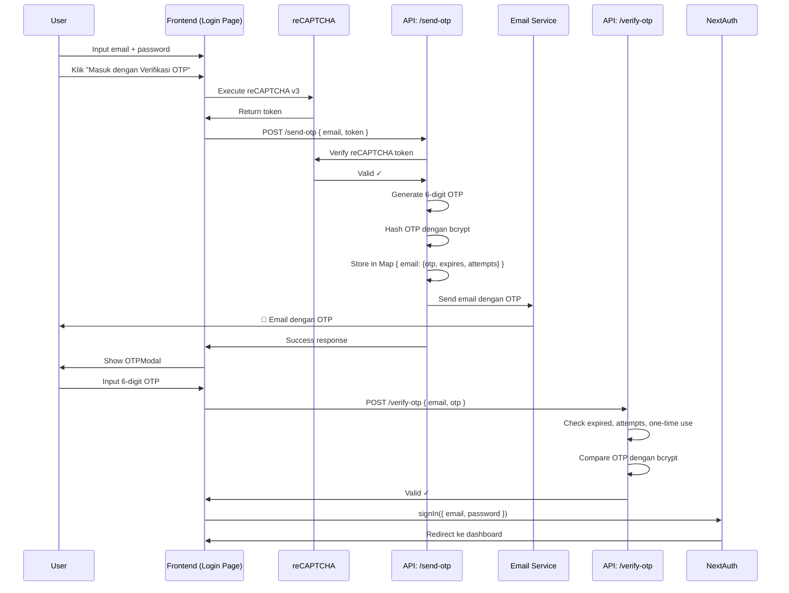

# 🔒 Setup Keamanan Login: CAPTCHA & OTP Email

Dokumentasi lengkap untuk konfigurasi fitur keamanan login dengan reCAPTCHA v3 dan OTP email verification.

---

## 📋 Daftar Isi

1. [Setup Google reCAPTCHA v3](#1-setup-google-recaptcha-v3)
2. [Setup Email Service (Gmail)](#2-setup-email-service-gmail)
3. [Konfigurasi Environment Variables](#3-konfigurasi-environment-variables)
4. [Testing](#4-testing)
5. [Troubleshooting](#5-troubleshooting)

---

## 1. Setup Google reCAPTCHA v3

### Langkah-langkah:

#### A. Daftar reCAPTCHA
1. Buka [Google reCAPTCHA Admin Console](https://www.google.com/recaptcha/admin/create)
2. Login dengan akun Google Anda
3. Klik tombol **"+"** atau **"Create"** untuk membuat site baru

#### B. Isi Form Registrasi
- **Label**: Nama aplikasi Anda (contoh: "PetaKarier Login")
- **reCAPTCHA type**: Pilih **reCAPTCHA v3**
- **Domains**: 
  ```
  localhost
  127.0.0.1
  your-production-domain.com
  ```
- **Accept the reCAPTCHA Terms of Service**: ✅ Centang
- Klik **Submit**

#### C. Dapatkan Keys
Setelah submit, Anda akan mendapat:
- **Site Key** (Public key untuk frontend)
- **Secret Key** (Private key untuk backend API)

Copy kedua keys tersebut dan simpan di file `.env`:

```env
NEXT_PUBLIC_RECAPTCHA_SITE_KEY="your-site-key-here"
RECAPTCHA_SECRET_KEY="your-secret-key-here"
```

#### D. Test Keys (Optional)
Google menyediakan test keys untuk development:
```env
# Test keys (auto-approve semua request)
NEXT_PUBLIC_RECAPTCHA_SITE_KEY="6LeIxAcTAAAAAJcZVRqyHh71UMIEGNQ_MXjiZKhI"
RECAPTCHA_SECRET_KEY="6LeIxAcTAAAAAGG-vFI1TnRWxMZNFuojJ4WifJWe"
```

⚠️ **PENTING**: Jangan gunakan test keys di production!

---

## 2. Setup Email Service (Gmail)

### Opsi 1: Gmail (Recommended)

#### A. Aktifkan 2-Factor Authentication
1. Buka [Google Account Security](https://myaccount.google.com/security)
2. Scroll ke **"Signing in to Google"**
3. Klik **"2-Step Verification"**
4. Ikuti wizard untuk mengaktifkan 2FA

#### B. Generate App Password
1. Setelah 2FA aktif, buka [App Passwords](https://myaccount.google.com/apppasswords)
2. **Select app**: Pilih **"Mail"** atau **"Other (Custom name)"**
3. **Select device**: Pilih **"Other (Custom name)"** → ketik "PetaKarier"
4. Klik **Generate**
5. Copy **16-digit app password** yang muncul (tanpa spasi)

#### C. Konfigurasi di .env
```env
EMAIL_HOST="smtp.gmail.com"
EMAIL_PORT="587"
EMAIL_SECURE="false"
EMAIL_USER="your-email@gmail.com"
EMAIL_PASS="abcd efgh ijkl mnop"  # 16-digit app password
```

### Opsi 2: Outlook/Hotmail

```env
EMAIL_HOST="smtp-mail.outlook.com"
EMAIL_PORT="587"
EMAIL_SECURE="false"
EMAIL_USER="your-email@outlook.com"
EMAIL_PASS="your-outlook-password"
```

### Opsi 3: Custom SMTP Server

```env
EMAIL_HOST="smtp.your-domain.com"
EMAIL_PORT="587"
EMAIL_SECURE="false"
EMAIL_USER="noreply@your-domain.com"
EMAIL_PASS="your-smtp-password"
```

---

## 3. Konfigurasi Environment Variables

### A. Copy Template
```bash
cp .env.example .env
```

### B. Edit File .env
Buka `.env` dan update values berikut:

```env
# ═══════════════════════════════════════════════════════════════
# SECURITY: Google reCAPTCHA v3
# ═══════════════════════════════════════════════════════════════
NEXT_PUBLIC_RECAPTCHA_SITE_KEY="your-actual-site-key"
RECAPTCHA_SECRET_KEY="your-actual-secret-key"

# ═══════════════════════════════════════════════════════════════
# EMAIL SERVICE: Nodemailer SMTP Configuration
# ═══════════════════════════════════════════════════════════════
EMAIL_HOST="smtp.gmail.com"
EMAIL_PORT="587"
EMAIL_SECURE="false"
EMAIL_USER="your-email@gmail.com"
EMAIL_PASS="your-16-digit-app-password"
```

### C. Restart Development Server
```bash
npm run dev
```

---

## 4. Testing

### A. Test reCAPTCHA

1. Buka halaman login: `http://localhost:3000/login`
2. Buka Browser DevTools → Console
3. Cari log: `reCAPTCHA token generated:` → harus ada token
4. Jika tidak ada error, reCAPTCHA sudah berfungsi ✅

### B. Test OTP Email

1. Isi email dan password di form login
2. Klik **"Masuk dengan Verifikasi OTP"**
3. Cek inbox email Anda
4. Seharusnya ada email dengan subject **"Kode OTP Login PetaKarier"**
5. Email berisi kode 6 digit OTP
6. Copy kode OTP dan masukkan di modal yang muncul
7. Jika berhasil verify → redirect ke dashboard ✅

### C. Test OTP Expiry & Rate Limit

**Test 1: OTP Expired (10 menit)**
- Request OTP
- Tunggu > 10 menit
- Input OTP → Error: "Kode OTP sudah kadaluarsa" ✅

**Test 2: Max Attempts (3 kali)**
- Request OTP
- Input kode salah 3 kali
- Error: "Terlalu banyak percobaan" ✅

**Test 3: One-time Use**
- Request OTP
- Gunakan OTP untuk login sukses
- Coba gunakan OTP yang sama lagi
- Error: "Kode OTP tidak valid atau sudah digunakan" ✅

---

## 5. Troubleshooting

### Error: "Failed to send OTP email"

**Kemungkinan Penyebab:**
1. Email credentials salah
2. App password tidak valid (Gmail)
3. 2FA belum aktif (Gmail)
4. SMTP port/host salah

**Solusi:**
```bash
# Cek environment variables
echo $EMAIL_USER
echo $EMAIL_HOST

# Test SMTP connection dengan curl
curl -v telnet://smtp.gmail.com:587

# Pastikan .env sudah load
cat .env | grep EMAIL_
```

### Error: "reCAPTCHA validation failed"

**Kemungkinan Penyebab:**
1. Site key/secret key salah
2. Domain tidak terdaftar di reCAPTCHA admin
3. Menggunakan test keys di production

**Solusi:**
1. Verifikasi keys di [reCAPTCHA Admin](https://www.google.com/recaptcha/admin)
2. Pastikan domain `localhost` sudah ditambahkan
3. Clear browser cache dan restart dev server

### Error: "Kode OTP tidak valid"

**Kemungkinan Penyebab:**
1. OTP expired (> 10 menit)
2. OTP sudah digunakan (one-time use)
3. Max attempts reached (3x salah)

**Solusi:**
1. Request OTP baru dengan klik **"Kirim Ulang OTP"**
2. Pastikan input 6 digit lengkap
3. Gunakan OTP dalam waktu 10 menit

### Production Deployment

⚠️ **PENTING untuk Production:**

1. **Ganti reCAPTCHA keys** dengan keys production (bukan test keys)
2. **Tambahkan production domain** di reCAPTCHA Admin Console, termasuk domain `*.vercel.app` yang digunakan
3. **Set environment variables di Vercel > Settings > Environment Variables > Production:**
  `DATABASE_URL`, `AUTH_SECRET`, `NEXT_PUBLIC_RECAPTCHA_SITE_KEY`, `RECAPTCHA_SECRET_KEY`, `EMAIL_HOST`, `EMAIL_PORT`, `EMAIL_USER`, dan `EMAIL_PASS`
4. **Buat tabel OTP di database production sebelum deploy:**
  ```bash
  npx prisma db push
  ```
  Jalankan command ini dengan `DATABASE_URL` production, bukan URL placeholder lokal.
5. **Setup email service production** dan pastikan SMTP mengizinkan koneksi dari Vercel
6. **Enable rate limiting** di API level
7. **Add monitoring** untuk OTP delivery failures

OTP disimpan di tabel `OtpVerification`, bukan memory proses, karena Vercel dapat menjalankan setiap request pada instance serverless yang berbeda.

---

## 📚 Referensi

- [Google reCAPTCHA v3 Docs](https://developers.google.com/recaptcha/docs/v3)
- [Gmail App Passwords](https://support.google.com/accounts/answer/185833)
- [Nodemailer Documentation](https://nodemailer.com/about/)
- [Next.js Environment Variables](https://nextjs.org/docs/app/building-your-application/configuring/environment-variables)

---

## 🎯 Flow Lengkap Login dengan OTP



---

## ✅ Checklist Setup

- [ ] Google reCAPTCHA v3 terdaftar
- [ ] Site key & secret key disimpan di `.env`
- [ ] Domain `localhost` ditambahkan di reCAPTCHA admin
- [ ] Gmail 2FA aktif
- [ ] Gmail App Password generated
- [ ] Email credentials di `.env`
- [ ] Development server restart
- [ ] Test login dengan OTP
- [ ] Email OTP diterima
- [ ] OTP verification berhasil

---

**🎉 Selamat! Fitur keamanan login sudah siap digunakan.**

Jika ada pertanyaan, silakan buka issue di repository atau hubungi tim development.
